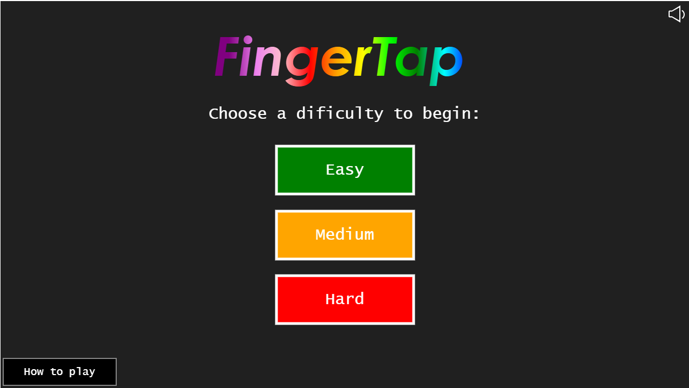

# FingerTap

Rhythm game developed for the Graphic animation course of the Technologies and Information Systems course for the Web licensed at ESMAD (School of Arts and Design Media).

## Technologies Used

* JavaScript

## Resources Used

* [Song](https://www.youtube.com/watch?v=UBVoONryE3s) - Youtube Link
* Images from Google Images

## Screenshots

